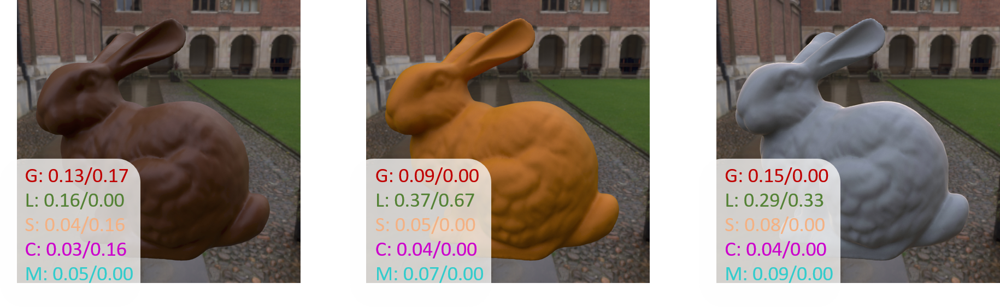

# The effect of shape and illumination on material perception: model and applications
Code for Siggraph 2021 paper: The effect of shape and illumination on material perception: model and applications.
<div align="center">  
  
# A Similarity Measure for Material Appearance   
[](http://mig.mpi-inf.mpg.de/)
[]()
[]()
[]()

</div>

![alt text][teaser]

[teaser]: https://github.com/Hans1984/material-illumination-geometry/blob/main/images/teaser.png "Robots teaser"

## Abstract   
Material appearance hinges on material reflectance properties but also surface geometry and illumination. The unlimited number of potential combinations between these factors makes understanding and predicting material appearance a very challenging task. In this work, we collect a large-scale dataset of perceptual ratings of appearance attributes with more than 215,680 responses for 42,120 distinct combinations of material, shape, and illumination. The goal of this dataset is twofold. First, we analyze for the first time the effects of illumination and geometry in material perception across such a large collection of varied appearances. We connect our findings to those of the literature, discussing how previous knowledge generalizes across very diverse materials, shapes, and illuminations. Second, we use the collected dataset to train a deep learning architecture for predicting perceptual attributes that correlate with human judgments. We demonstrate the consistent and robust behavior of our predictor in various challenging scenarios, which, for the first time, enables estimating perceived material attributes from general 2D images. Since the predictor relies on the final appearance in an image, it can compare appearance properties across different geometries and illumination conditions. Finally, we demonstrate several applications that use our predictor, including appearance reproduction using 3D printing, BRDF editing by integrating our predictor in a differentiable renderer, illumination design, or material recommendations for scene design.

## Environment Setting it up   
```bash
 conda env create -f environment.yml
```

### Dependencies
First, clone and install dependencies   
```bash
# clone project   
git clone https://github.com/Hans1984/material-illumination-geometry.git      
```

Get model pretrained weights
- download model [weights](https://drive.google.com/file/d/1nEvTcSOaWxQGpS19JMyStr6NWy38Pcvm/view?usp=sharing)
- download dataset [dataset]()

## How to test
Here we give several test images with labels under the folder ./test. To test, you can download the pre-trained model, put it under the ./weights folder.  <br>
Run:
```bash
python main.py
```

### How to Train a new model
Edit the config.py, put training data under 'input_path' and labels under gt_path.  <br>
Run:
```bash
python main.py --is_test False
```
### Predictor Examples

Here are testing examples, we show the predictor results with human annotation.
<div align="center">  

</div>

## Citation   
If you found this code useful please cite our work as:
```
@article{SIGG2021_Materials,
        author = {Serrano, Ana and Chen, Bin and Wang, Chao, and Piovarci, Michal and Seidel, Hans-Peter and Didyk, Piotr and Myszkowski, Karol},
        title = {The effect of shape and illumination on material perception: model and applications},
        journal = {ACM Trans. on Graph.},
        year = {2021},
    }
```   
